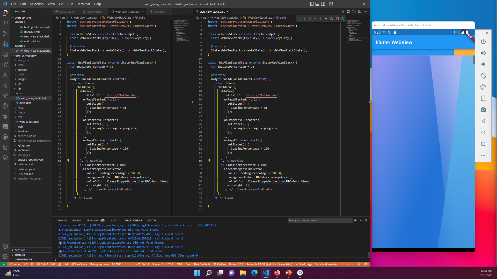
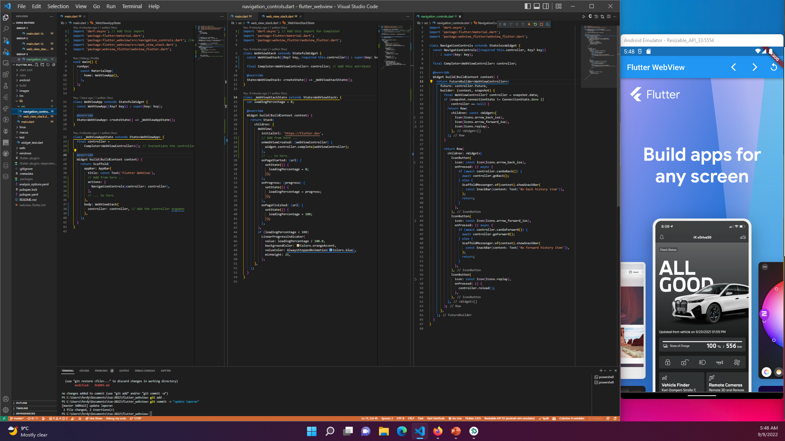
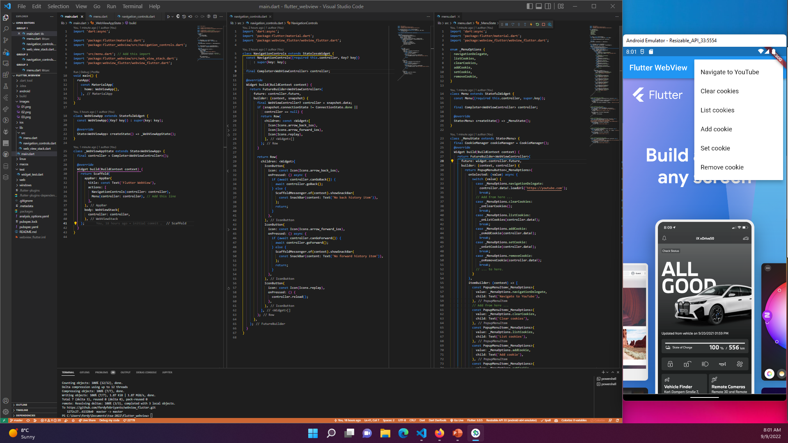
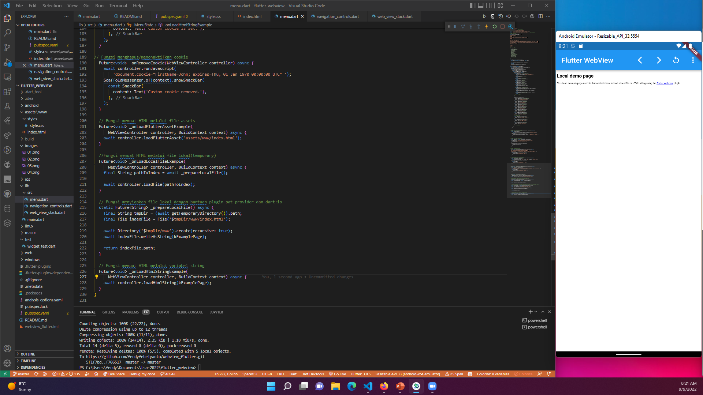

# #25 | Web View Flutter Plugin (TSA 2022)

## Tujuan Praktikum

* Mampu mengonfigurasi plugin webview 
* Mampu menerapkan halaman dengan load progress events
* Mampu melakukan kontrol halaman dan navigasi 
* Mampu mengolah data cookie 
* Mampu menampilkan string HTML dan file asset

## Plugin yang Digunakan

* [webview_flutter](https://pub.dev/packages/webview_flutter)

# Praktikum

Link praktikum: [link]()

## 1. Hasil Tampilan Web View

## 2. Hasil Load Progress Event

## 3. Hasil Web Controller dan Navigasi

## 4. Hasil Mengelola Cookie

## 5. Hasil Membuat String HTML

